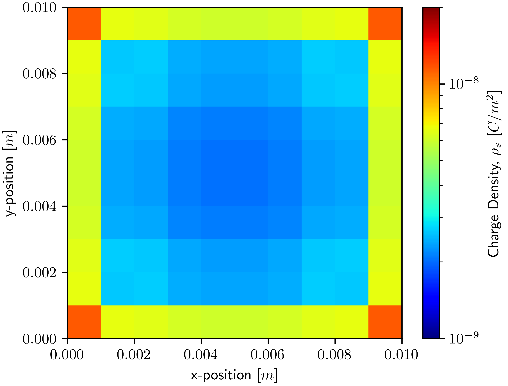
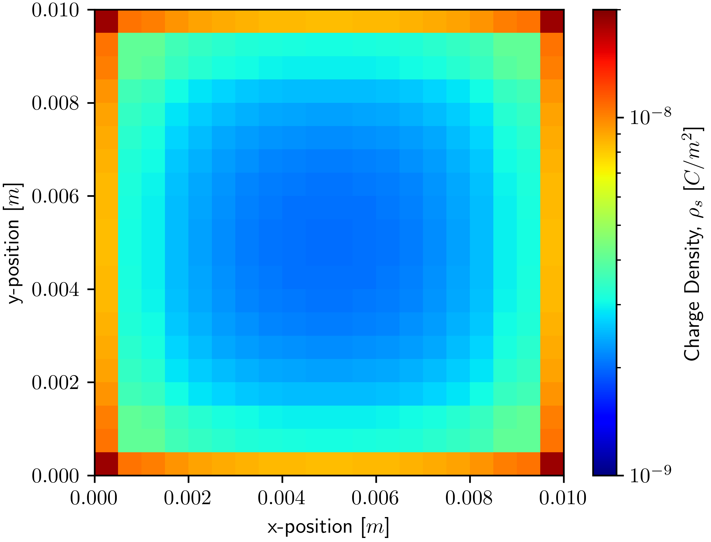
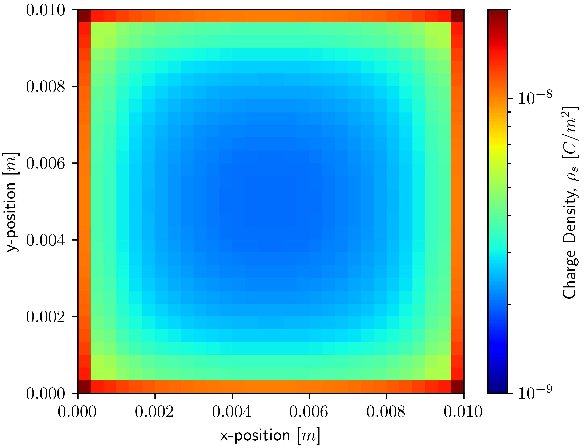
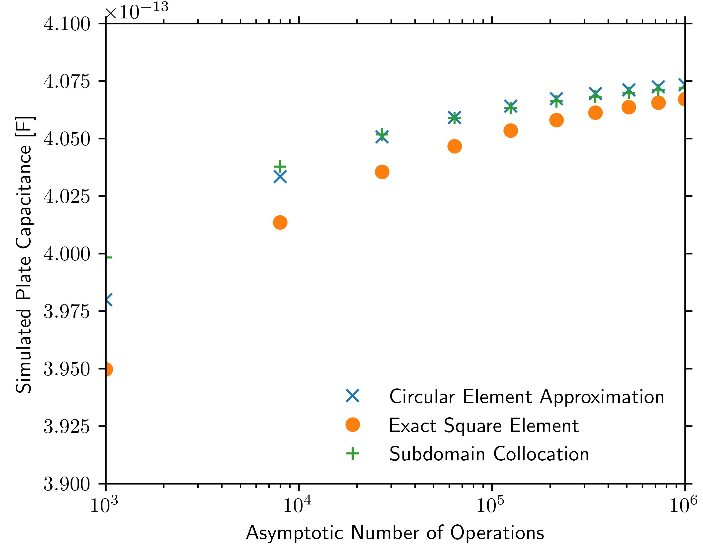

# mom-capacitance

A 2D Method of Moments (MoM) square parallel plate capacitance solver for a graduate CEM course offered at Purdue University.
At the request of the instructor, the course details and project report have been removed from this repository.
Please reach out if you are interested in the course details and project report.

This codebase, as well as others from this class, are not designed to be user-friendly as they were only intended to be
run by myself for the purpose of a class project. With that said however all code is reasonably documented to the
standards outlined in this course.

## Requirements

If you do not have it installed already, you will first need to [download and install Python](https://www.python.org/).

Next, you will need to install `NumPy`, `SciPy` and `Matplotlib` all of which are dependencies for this project.
To install said packages, run the following command in your terminal of choice.

### Windows

    pip install numpy scipy matplotlib

### Linux/Mac

    pip3 install numpy scipy matplotlib

## Running

All project configuration occurs in `./src/main.py`.

Once configured, the model can be run from the project root with one of the following terminal commands.

### Windows

    python ./src/main.py

### Linux/Mac

    python3 ./src/main.py

## Data

This model does not write any data beyond that to standard out.
The model will however plot the charge distribution for the configured grid and method.
If you have TeX Live or another TeX distribution, you can uncomment line 101 in `Solver.py` to render plot text with
TeX.

## Example Results

Below are several labeled figures from the report.

1. Modeled 10x10 Charge Distribution using Subdomain Collocation
   

2. Modeled 20x20 Charge Distribution using Subdomain Collocation
   

3. Modeled 30x30 Charge Distribution using Subdomain Collocation
   

4. Convergence Study of Method of Moments Elements as a Function of the Asymptotic Number of Operations (Grid
   Resolution) Required to Solve
   

